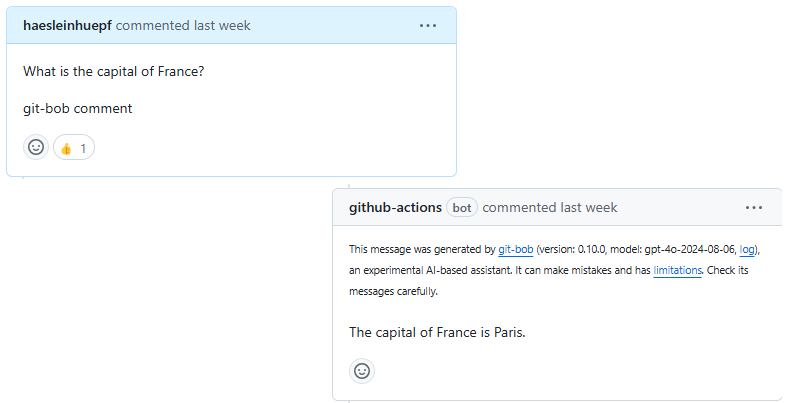

# git-bob: playground

In this repository, you can [create an issue](https://github.com/haesleinhuepf/git-bob-playground/issues/new/choose) which will then be answered by [git-bob](https://github.com/haesleinhuepf/git-bob) an AI-assistant. To make sure that the system does not get overwhelmed with requests, [@haesleinhuepf](https://github.com/haesleinhuepf) has to review requests and can also help guiding the AI-assistant so that useful results come out.

This is a research project that serves exploring how we humans need to interact with AI-assistants to get reliable and trustworthy results. 
It may be changed or shut down at any time.

**Note:** Your images and the text you enter here may be sent to [OpenAI](https://openai.com/)'s online service ([Third party terms of use](https://openai.com/policies/row-terms-of-use/)) or [Anthropic's claude](https://www.anthropic.com/api) online service ([Terms of service](https://www.anthropic.com/legal/consumer-terms)) or [Google AI](https://ai.google.dev/) ([Terms of service](https://ai.google.dev/gemini-api/terms)) where we use a large language model to answer your request. 
Do not upload any data you cannot share openly. Also, do not enter any private or secret information. By submitting this GitHub issue, you confirm that you understand these conditions.

## Feedback welcome

If you tried git-bob on your own, you also directly provide feedback to the AI-assistant by [opening an issue on its repository](https://github.com/haesleinhuepf/git-bob).

How many b are in blueberry? 2

